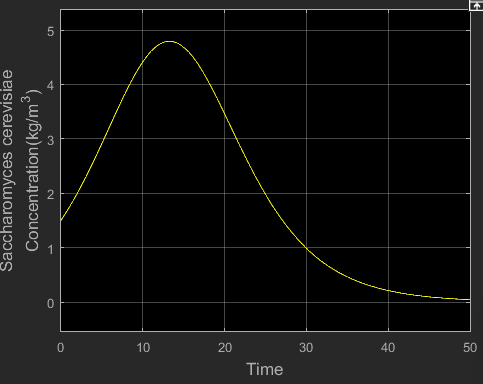
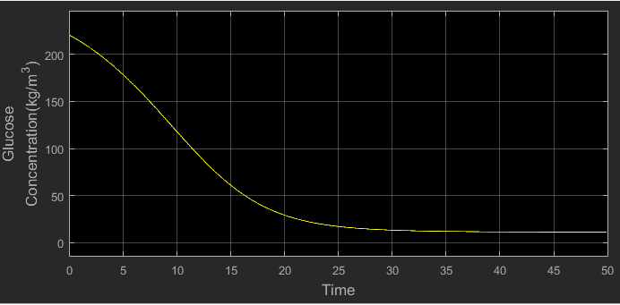

# Bioethanol Production Simulation using *Saccharomyces cerevisiae*

## 📌 Overview
This repository contains a **Simulink-based dynamic model** for bioethanol production via *Saccharomyces cerevisiae* fermentation.  
The model simulates yeast growth, substrate (glucose) consumption, and ethanol production under given operating conditions.

The model uses **Monod-type kinetics with temperature-dependent growth and death rates**, suitable for batch fermentation modeling.

---

## ⚙️ Features
- ✅ Temperature-dependent microbial growth kinetics  
- ✅ Substrate and product inhibition effects  
- ✅ Ethanol production coupled with substrate consumption  
- ✅ Adjustable parameters for different process conditions  
- ✅ Ready-to-run Simulink model  

---

---

---

## 🔍 Model Description

### **State Variables**
- **X (kg/m³):** Biomass concentration (*Saccharomyces cerevisiae*)
- **S (kg/m³):** Substrate concentration (glucose)  
- **P (kg/m³):** Product concentration (ethanol)  

## 📌 Parameters

### **Kinetic Parameters**
| Parameter       | Value         |
|-----------------|-------------|
| Ks         | 1.7 kg/m³   |
| [P]max   | 93 kg/m³    |
| n           | 0.52        |
| YX/S     | 0.08        |
| YP/S    | 0.45        |
| m          | 0.03 h⁻¹   |

### **Process Conditions**
| Parameter                      | Value          |
|--------------------------------|--------------|
| Initial biomass (X₀)          | 1.5 kg/m³   |
| Initial glucose (S₀)          | 220 kg/m³   |
| Fermentation temperature       | 30°C (303 K)|

---

## ▶️ How to Run
1. Open **BioEthanolProduction.slx** in MATLAB Simulink.
2. Set initial conditions: X₀ = 1.5 kg/m³, S₀ = 220 kg/m³.
3. Set temperature: 303 K.
4. Run simulation for desired duration (e.g., 50 h).
5. View **Scope** outputs for X, S, P over time.

---

## ✅ Outputs
- **Biomass growth curve** (lag, exponential, stationary)

 
- **Substrate(Glucose) depletion curve**

  
- **Ethanol production curve**

--

## 🔍 Applications
- Bioethanol process optimization  
- Fermentation strategy testing (**Identifying the optimal time to end the fermentation and collect the ethanol**) 
- Sensitivity analysis of kinetic parameters  
- Understanding how factors like **intial glucose concentration**, **temperature**  or **pH** affects the rate of microbial growth and ethanol production.
---
For more about **batch fermentation** and how the above output curves relate to each other visit -
[Link](https://doi.org/10.1016/j.biortech.2003.09.009)
### ✅ Requirements
- MATLAB with Simulink  
- Optimization Toolbox (optional for parameter estimation)  

